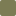

# What this is
This repository contains:
- My dot files for my hyprland setup
- Scripts to set up everything from a fresh arch install (assuming btrfs and luks are already set up through archinstall)
- Theme implementations for various programs

Some configs will have files ignored by git related to the color scheme / theme.  The missing files 
are located in `./themes`.  I use a script to easily swap out themes.
The script is `./themes/setTheme.sh`

# ⚠️Ags setup moved into a new project repo => https://github.com/JohnOberhauser/OkPanel

# Theme Showcase

## Varda

### Color Palette

This color palette is home-grown

#### Primary
`#D0EBEE`  white  
`#0C0E11`  black  
`#52677C`  blue  
`#733447`  red  
`#257B76`  green  
`#C78C56`  peach  
`#665276`  violet  
`#8295A9`  blue grey

#### Background variants 
`#121519`  dark grey  
`#171B21`  dark grey 2   
`#1C2128`  dark grey 3    
`#222830`  dark grey 4  
`#272E38`  dark grey 5  
`#38414F`  dark grey 6

## Everforest

### Color Palette

This color palette is from [sainnhe](https://github.com/sainnhe/everforest?tab=readme-ov-file)

`#D3C6AA`  fg  
`#E67E80`  red  
`#E69875`  orange  
`#A7C080`  green  
`#DBBC7F`  yellow  
`#7A8478`  gray0  
`#D699B6`  purple  
`#83C092`  aqua  
`#7FBBB3`  blue  

`#1E2326`  bg_dim  
`#272E33`  bg0  
`#2E383C`  bg1  
`#374145`  bg2  
`#414B50`  bg3  
`#495156`  bg4  
`#4F5B58`  bg5  

## Nord

### Color Palette

This color palette is from [nord theme](https://www.nordtheme.com/)

#### Polar Night

`#2E3440`  nord0  
`#3B4252`  nord1  
`#434C5E`  nord2  
`#4C566A`  nord3  

#### Snow Storm

`#D8DEE9`  nord4  
`#E5E9F0`  nord5  
`#ECEFF4`  nord6  

#### Frost

`#8FBCBB`  nord7  
`#88C0D0`  nord8  
`#81A1C1`  nord9  
`#5E81AC`  nord10  

#### Aurora

`#BF616A`  nord11  
`#D08770`  nord12  
`#EBCB8B`  nord13  
`#A3BE8C`  nord14  
`#B48EAD`  nord15  

## Rose Pine

### Color Palette

This color palette is from [rose pine theme](https://rosepinetheme.com/)

`#191724`  base  
`#1F1D2E`  surface  
`#21202E`  highlightLow  
`#26233A`  overlay  
`#403D52`  highlightMed  
`#524F67`  highlightHigh   
`#6E6A86`  muted  
`#908CAA`  subtle  

`#E0DEF4`  text  
`#EB6F92`  love  
`#F6C177`  gold  
`#EBBCBA`  rose  
`#31748F`  pine  
`#9CCFD8`  foam  
`#C4A7E7`  iris  

## Blood Rust

### Color Palette

This color palette is home-grown

#### Primary
`#AFB3BD`  white  
`#1F2932`  black  
`#7C545F`  red  
`#54737C`  blue  
`#547C71`  green  
`#7C7C54`  yellow  
`#72547C`  purple    
`#5E4D52`  brown

#### Background variants
`#222E38`  dark grey  
`#25323D`  dark grey 2   
`#293642`  dark grey 3    
`#2C3A47`  dark grey 4  
`#2F3E4C`  dark grey 5  
`#324351`  dark grey 6

## Desert Power

### Color Palette

This color palette is home-grown

#### Primary
`#A1A09F`  white  
`#11100F`  black  
`#55504D`  primary    
`#8EBABB`  blue  
`#385752`  green  
`#9EA886`  yellow  
`#B5745A`  red    
`#AF8F6B`  lion    

#### Background variants
`#161413`  dark grey  
`#1A1817`  dark grey 2   
`#1E1C1B`  dark grey 3    
`#22201E`  dark grey 4    
`#33302D`  dark grey 5    
`#3C3834`  dark grey 6    

## Catppuccin Latte

### Color Palette

From the Catppuccin Latte theme

#### Accents

`#dc8a78`  rosewater    
`#dd7878`  flamingo    
`#ea76cb`  pink    
`#8839ef`  mauve    
`#d20f39`  red    
`#e64553`  maroon    
`#fe640b`  peach    
`#df8e1d`  yellow    
`#40a02b`  green    
`#179299`  teal    
`#04a5e5`  sky    
`#209fb5`  sapphire    
`#1e66f5`  blue    
`#7287fd`  lavender    

#### Text and UI

`#4c4f69`  text    
`#5c5f77`  subtext1    
`#6c6f85`  subtext0    
`#7c7f93`  overlay2    
`#8c8fa1`  overlay1    
`#9ca0b0`  overlay0    
`#acb0be`  surface2    
`#bcc0cc`  surface1    
`#ccd0da`  surface0    

#### Background

`#eff1f5`  base    
`#e6e9ef`  mantle    
`#dce0e8`  crust    

## Catppuccin Frappé

### Color Palette

From the Catppuccin Frappé theme

#### Accents

`#f2d5cf`  rosewater    
`#eebebe`  flamingo    
`#f4b8e4`  pink    
`#ca9ee6`  mauve    
`#e78284`  red    
`#ea999c`  maroon    
`#ef9f76`  peach    
`#e5c890`  yellow    
`#a6d189`  green    
`#81c8be`  teal    
`#99d1db`  sky    
`#85c1dc`  sapphire    
`#8caaee`  blue    
`#babbf1`  lavender    

#### Text and UI

`#c6d0f5`  text    
`#b5bfe2`  subtext1    
`#a5adce`  subtext0    
`#949cbb`  overlay2    
`#838ba7`  overlay1    
`#737994`  overlay0    
`#626880`  surface2    
`#51576d`  surface1    
`#414559`  surface0    

#### Background

`#303446`  base    
`#292c3c`  mantle    
`#232634`  crust    

## Catppuccin Macchiato

### Color Palette

From the Catppuccin Macchiato theme

#### Accents

`#f4dbd6`  rosewater    
`#f0c6c6`  flamingo    
`#f5bde6`  pink    
`#c6a0f6`  mauve    
`#ed8796`  red    
`#ee99a0`  maroon    
`#f5a97f`  peach    
`#eed49f`  yellow    
`#a6da95`  green    
`#8bd5ca`  teal    
`#91d7e3`  sky    
`#7dc4e4`  sapphire    
`#8aadf4`  blue    
`#b7bdf8`  lavender    

#### Text and UI

`#cad3f5`  text    
`#b8c0e0`  subtext1    
`#a5adcb`  subtext0    
`#939ab7`  overlay2    
`#8087a2`  overlay1    
`#6e738d`  overlay0    
`#5b6078`  surface2    
`#494d64`  surface1    
`#363a4f`  surface0    

#### Background

`#24273a`  base    
`#1e2030`  mantle    
`#181926`  crust    

## Catppuccin Mocha

### Color Palette

From the Catppuccin Mocha theme

#### Accents

`#f5e0dc`  rosewater    
`#f2cdcd`  flamingo    
`#f5c2e7`  pink    
`#cba6f7`  mauve    
`#f38ba8`  red    
`#eba0ac`  maroon    
`#fab387`  peach    
`#f9e2af`  yellow    
`#a6e3a1`  green    
`#94e2d5`  teal    
`#89dceb`  sky    
`#74c7ec`  sapphire    
`#89b4fa`  blue    
`#b4befe`  lavender    

#### Text and UI

`#cdd6f4`  text    
`#bac2de`  subtext1    
`#a6adc8`  subtext0    
`#9399b2`  overlay2    
`#7f849c`  overlay1    
`#6c7086`  overlay0    
`#585b70`  surface2    
`#45475a`  surface1    
`#313244`  surface0    

#### Background

`#1e1e2e`  base    
`#181825`  mantle    
`#11111b`  crust    