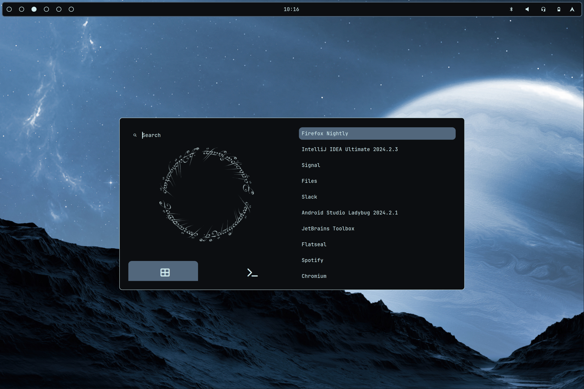
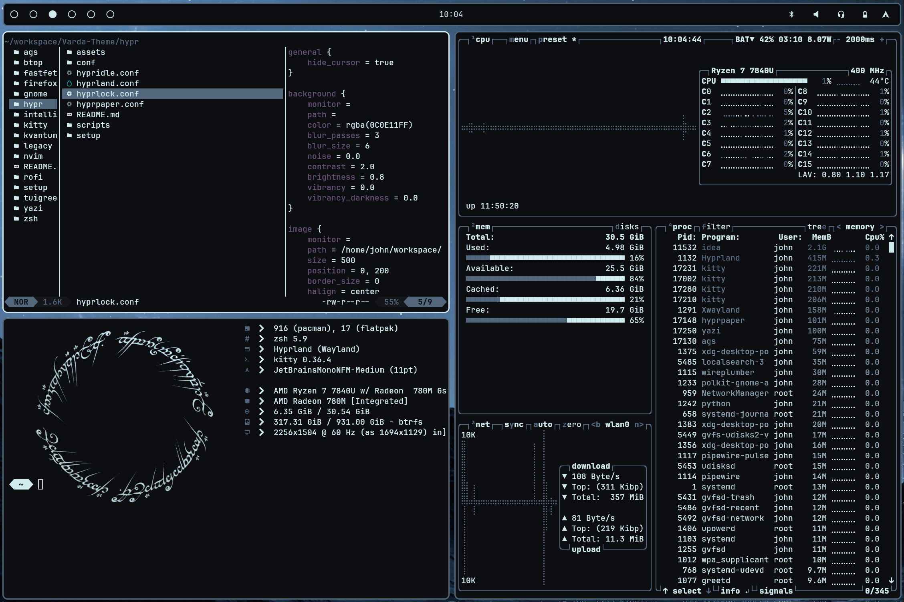
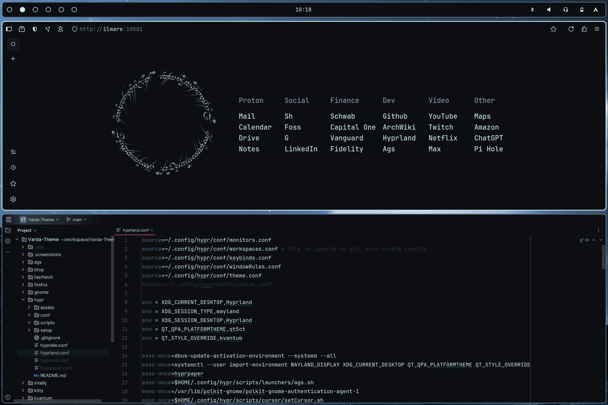
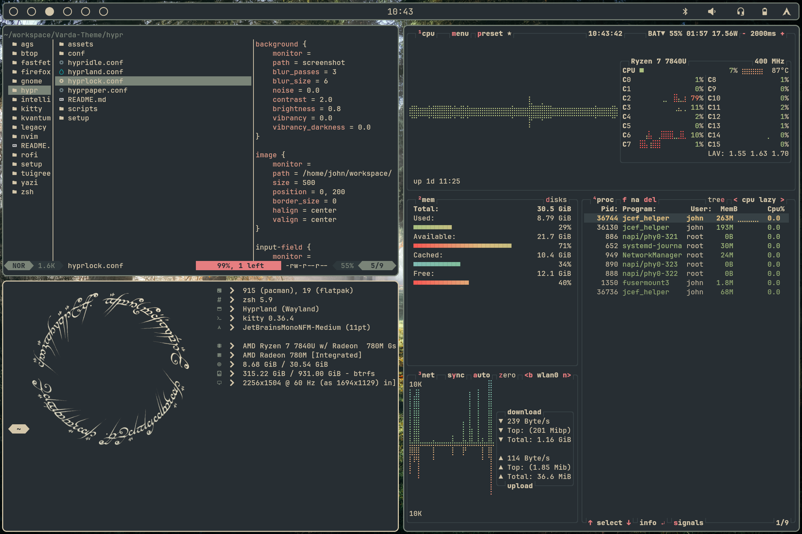
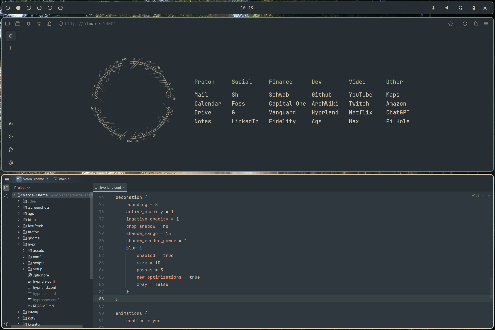
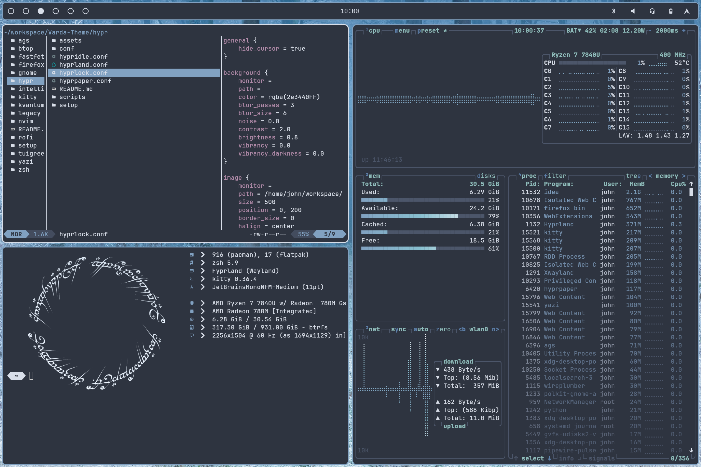
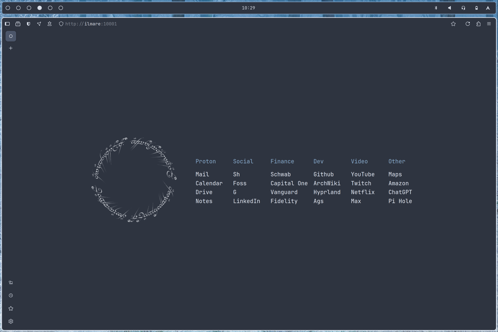

# What this is
This repository contains:
- My dot files for my hyprland setup
- Scripts to set up everything from a fresh arch install
- Theme implementations for various programs for the Varda theme

Some configs will have files ignored by git related to the color scheme / theme.  The missing files 
are located in `./setup/themes`.  I use a script to easily swap out themes.
The script is `./setup/scripts/setTheme.sh`

# Theme Showcase

## Varda

### Color Palette

This color palette is home-grown

#### Primary
`#D0EBEE`  white  
`#0C0E11`  black  
`#52677C`  blue  
`#733447`  red  
`#257B76`  green  
`#C78C56`  peach  
`#665276`  violet  
`#8295A9`  blue grey

#### Secondary variants
`#141619`  dark grey  
`#2E3436`  dark grey 2  
`#3b4444`  dark grey 3  
`#E5FFFF`  light white  
`#93394A`  light red  
`#98C379`  light green

## Everforest

### Color Palette

This color palette is from [sainnhe](https://github.com/sainnhe/everforest?tab=readme-ov-file)

`#272E33`  bg0  
`#2E383C`  bg1  
`#D3C6AA`  fg  
`#E67E80`  red  
`#A7C080`  green  
`#DBBC7F`  yellow  
`#7A8478`  gray0  
`#D699B6`  purple  
`#83C092`  aqua  
`#7FBBB3`  blue  

## Nord

### Color Palette

This color palette is from [nord theme](https://www.nordtheme.com/)

#### Polar Night

`#2E3440`  nord0  
`#3B4252`  nord1  
`#434C5E`  nord2  
`#4C566A`  nord3  

#### Snow Storm

`#D8DEE9`  nord4  
`#E5E9F0`  nord5  
`#ECEFF4`  nord6  

#### Frost

`#8FBCBB`  nord7  
`#88C0D0`  nord8  
`#81A1C1`  nord9  
`#5E81AC`  nord10  

#### Aurora

`#BF616A`  nord11  
`#D08770`  nord12  
`#EBCB8B`  nord13  
`#A3BE8C`  nord14  
`#B48EAD`  nord15  
