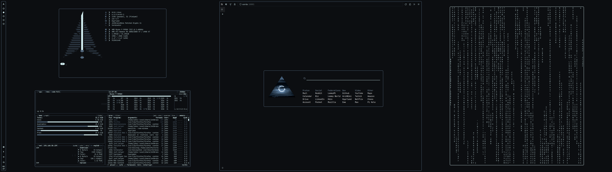

# Varda-Theme
A theme for various programs, largly surrounding my hyprland setup




# Color Pallete
```
# Primary Hex
white: D0EBEE
black: 0C0E11
blue: 52677C
red: 733447
green: 257B76
peach: C78C56
purple: 604575
aqua: 134A5A

# Primary RGB
black: [12, 14, 17]
white: [208, 235, 238]
blue: [82, 103, 124]
grey: [46, 52, 54]
red: [115, 52, 71]
green: [37, 123, 118]
peach: [199, 140, 86]
purple: [66, 71, 90]

# Secondary
derk_grey: 141619
dark_grey2: 2E3436
dark_grey3: 3b4444
light_white: E5FFFF
neon: 80BB00
light_blue: 8295A9
light_red: 93394A
light_green: 98C379