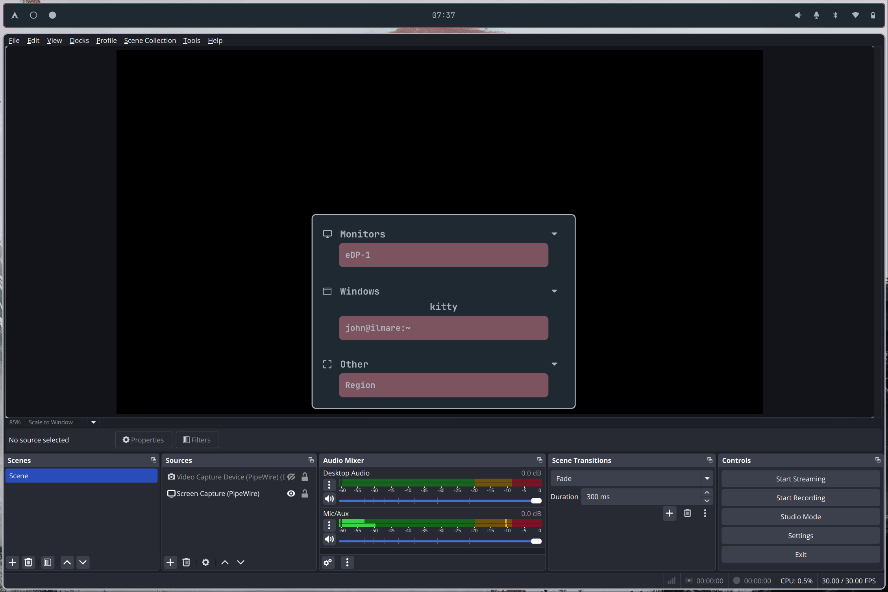

# What this is
This repository contains:
- My dot files for my hyprland setup
- Scripts to set up everything from a fresh arch install (assuming btrfs and luks are already set up through archinstall)
- Theme implementations for various programs

Some configs will have files ignored by git related to the color scheme / theme.  The missing files 
are located in `./themes`.  I use a script to easily swap out themes.
The script is `./themes/setTheme.sh`

# Ags Feature Showcase

### Network management

### Bluetooth device management

### Audio controls

### Look and Feel controls for theme, bar position, menu position, clock position, and wallpaper

### Mpris media controls

### Notification popups and history

### Screenshot and screen recording tool

### App launcher

### Calendar

### Volume and brightness alerts

### Screen share portal

# Theme Showcase 

## Varda

### Color Palette

This color palette is home-grown

#### Primary
`#D0EBEE`  white  
`#0C0E11`  black  
`#52677C`  blue  
`#733447`  red  
`#257B76`  green  
`#C78C56`  peach  
`#665276`  violet  
`#8295A9`  blue grey

#### Background variants 
`#121519`  dark grey  
`#171B21`  dark grey 2   
`#1C2128`  dark grey 3    
`#222830`  dark grey 4  
`#272E38`  dark grey 5  
`#38414F`  dark grey 6

## Everforest

### Color Palette

This color palette is from [sainnhe](https://github.com/sainnhe/everforest?tab=readme-ov-file)

`#D3C6AA`  fg  
`#E67E80`  red  
`#E69875`  orange  
`#A7C080`  green  
`#DBBC7F`  yellow  
`#7A8478`  gray0  
`#D699B6`  purple  
`#83C092`  aqua  
`#7FBBB3`  blue  

`#1E2326`  bg_dim  
`#272E33`  bg0  
`#2E383C`  bg1  
`#374145`  bg2  
`#414B50`  bg3  
`#495156`  bg4  
`#4F5B58`  bg5  

## Nord

### Color Palette

This color palette is from [nord theme](https://www.nordtheme.com/)

#### Polar Night

`#2E3440`  nord0  
`#3B4252`  nord1  
`#434C5E`  nord2  
`#4C566A`  nord3  

#### Snow Storm

`#D8DEE9`  nord4  
`#E5E9F0`  nord5  
`#ECEFF4`  nord6  

#### Frost

`#8FBCBB`  nord7  
`#88C0D0`  nord8  
`#81A1C1`  nord9  
`#5E81AC`  nord10  

#### Aurora

`#BF616A`  nord11  
`#D08770`  nord12  
`#EBCB8B`  nord13  
`#A3BE8C`  nord14  
`#B48EAD`  nord15  

## Rose Pine

### Color Palette

This color palette is from [rose pine theme](https://rosepinetheme.com/)

`#191724`  base  
`#1F1D2E`  surface  
`#21202E`  highlightLow  
`#26233A`  overlay  
`#403D52`  highlightMed  
`#524F67`  highlightHigh   
`#6E6A86`  muted  
`#908CAA`  subtle  

`#E0DEF4`  text  
`#EB6F92`  love  
`#F6C177`  gold  
`#EBBCBA`  rose  
`#31748F`  pine  
`#9CCFD8`  foam  
`#C4A7E7`  iris  

## Blood Rust

### Color Palette

This color palette is home-grown

#### Primary
`#AFB3BD`  white  
`#1F2932`  black  
`#7C545F`  red  
`#54737C`  blue  
`#547C71`  green  
`#7C7C54`  yellow  
`#72547C`  purple    
`#5E4D52`  brown

#### Background variants
`#222E38`  dark grey  
`#25323D`  dark grey 2   
`#293642`  dark grey 3    
`#2C3A47`  dark grey 4  
`#2F3E4C`  dark grey 5  
`#324351`  dark grey 6
